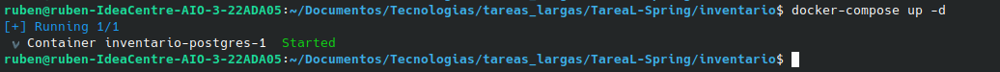
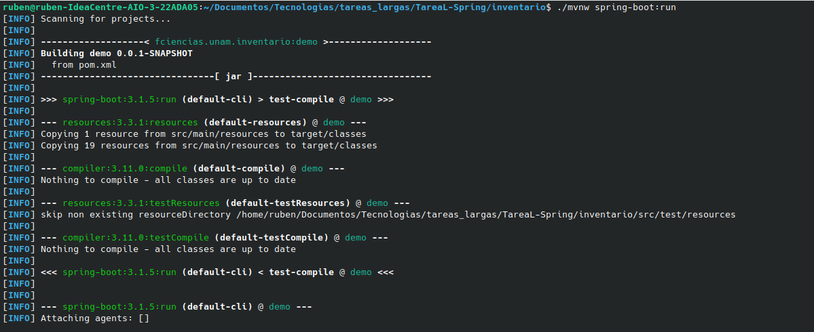
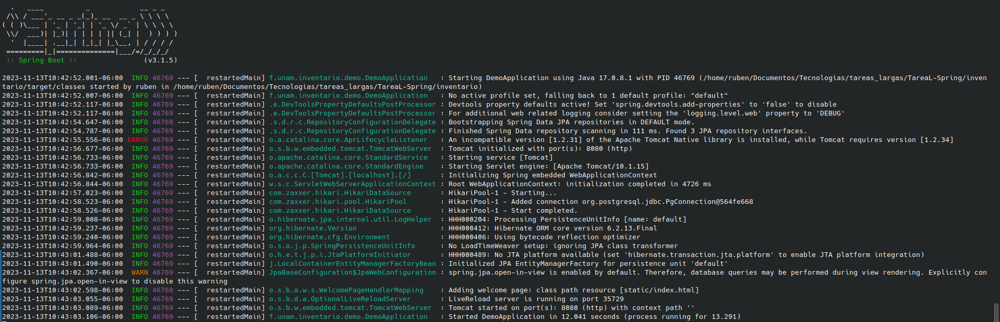
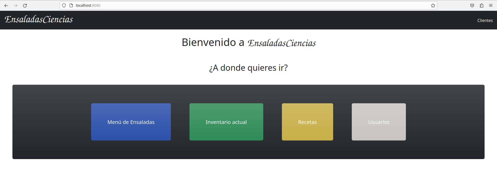

# Tarea larga - Spring
- Israel Hernández Dorantes - 318206604
- Rubén Acosta Arzate - 317205776

## Descripción del Proyecto:

El proyecto consiste en una aplicacion web que corre una pagina de Ensaladas que esta conectada a una base de datos, en la que es posible checar ensaladas, sus recetas y hay un inventario donde estan los ingredientes para las ensaladas en donde es posible eliminar, agregar y editar ingrediente.

## Como ejecutar el Proyecto:

Para ejecutar el proyecto se debe mover a la carpeta del proyecto, y a la carpeta inventario dentro de este.
es necesario tener docker y ejecutar:

```
docker-compose up -d
```

| 
|:--------------------------------:|
| Ejecutando docker-compose up -d en la terminal


Posteriormente ya con el repositorio de docker corriendo ejecutamos:

```
./mvnw spring-boot:run
```

| 
|:--------------------------------:|
| Ejecutando la aplicacion


| 
|:--------------------------------:|
| Aplicacion corriendo


Donde si todo salio bien la aplicacion deberia estar corriendo en el puerto 8080.

Para verla solo basta abrir en el navegador:

   http://localhost:8080/

Y deberia estar viendo una pagina similar a esta:


| 
|:--------------------------------:|
| Aplicacion pagina ensaladas corriendo en el puerto 8080